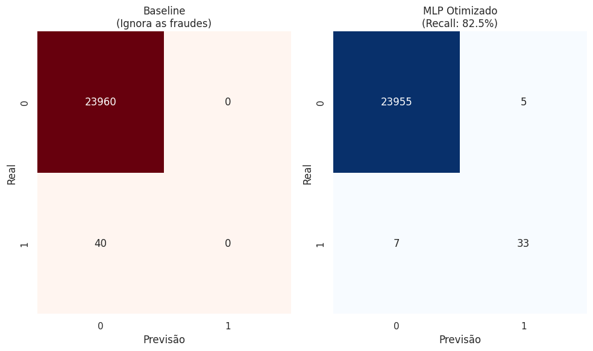
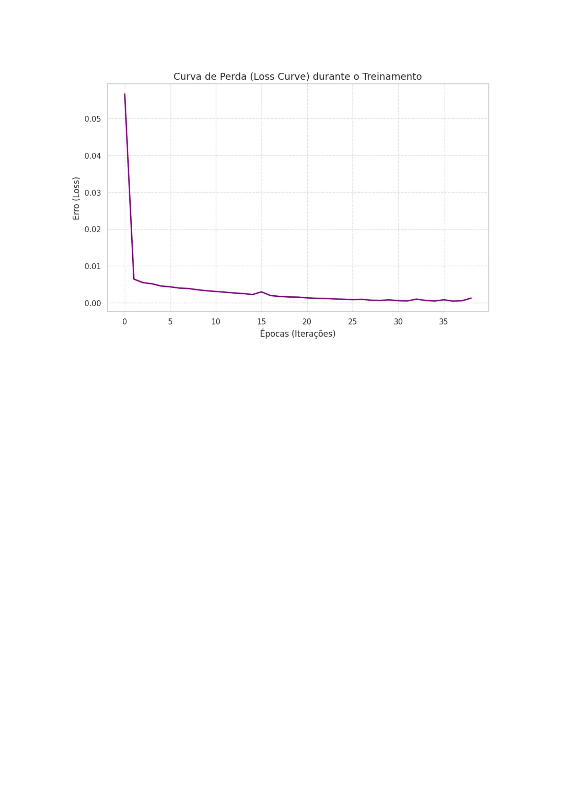

# Fraud Detector - Credit Card Fraud Detection

## Description

This project implements an **Artificial Intelligence** model capable of identifying fraudulent credit card transactions, prioritizing **Recall** to maximize the detection of real fraud cases. The model uses **Artificial Neural Networks (MLP)** trained with data balancing techniques to address the challenge of imbalanced classes.

## 📊 Results and Demonstration

The model's performance was compared with a simple statistical baseline. While the baseline fails to detect any fraud due to imbalance, the Neural Network (MLP) demonstrates high effectiveness.

### Performance Comparison

| Metric | Baseline (Statistical Guess) | MLP (Artificial Intelligence) |
| :--- | :---: | :---: |
| **Frauds Detected** | 0 out of 40 | **33 out of 40** |
| **Recall** | 0.00% | **82.50%** |
| **F1-Score** | 0.00% | **84.62%** |

### Confusion Matrix
Below is the visual comparison between the Baseline (which ignores fraud) and the Optimized MLP (which identifies the vast majority of real fraud cases).

### Loss Curve
The graph below shows the convergence of the error during the neural network training, indicating stable learning.

---

## Context

Credit card fraud represents a critical problem in the financial sector. This project was developed as part of the **MEISSA** training program (LIAD/HP), focusing on practical Machine Learning applications for anomaly detection in financial data.

## Technologies Used

- **Python 3.x**
- **Pandas** - Data manipulation and analysis
- **NumPy** - Numerical computation
- **Matplotlib & Seaborn** - Data visualization
- **Scikit-learn** - Machine Learning
  - MLPClassifier (Artificial Neural Network)
  - StandardScaler (Normalization)

## Methodology

1. **Preprocessing**: Normalization of the `Amount` column via StandardScaler.
2. **Balancing**: Application of **Undersampling** on the training set (400:1 ratio).
3. **Architecture**: MLP Neural Network with 3 hidden layers (64, 32, and 16 neurons).
4. **Evaluation**: Focus on Recall to minimize false negatives (undetected fraud).

## How to Run

Click the "Open in Colab" badge at the top of this README to run the notebook directly in your browser.

## Author

**Luiz Anselmo Medeiros Lima**
- GitHub: [@luizmlima](https://github.com/luizmlima)
- LinkedIn: [Luiz Anselmo Lima](https://www.linkedin.com/in/luiz-anselmo-lima)

## MEISSA Project

This project was developed as part of the **MEISSA** training program, a partnership between the **Laboratório de Inteligência Artificial e Arquiteturas Dedicadas (LIAD)** and **HP**.
